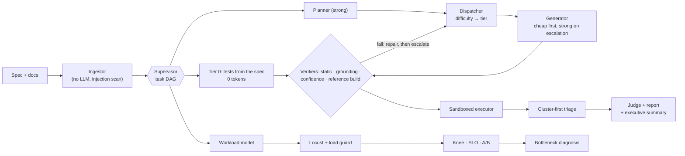

# AgentQA

**Give it an OpenAPI spec and the requirement docs your product team already wrote. Get back a
risk-ranked test plan, executable API tests, a run, triaged findings with evidence, a performance
diagnosis and an executive summary.** The whole system is observable, guarded and measured, and an
MCP server exposes it to coding agents.

> Status: proof of concept. The numbers below were measured with **simulated models**: the build
> environment had no API keys (see [Limitations](docs/LIMITATIONS.md)). They show the system's mechanics,
> not a real model's quality. `make eval-live` produces real-model tables.

## The problem
API suites lag behind requirements, and the expensive bugs are business rules rather than schema
errors: totals off by a cent, one customer reading another's order, a cancelled order shipped, a forged
payment webhook accepted. Writing those tests by hand is slow. Letting an LLM write them raises three
new problems: invented endpoints, unverifiable findings and runaway cost. AgentQA addresses each one
with a mechanism you can point at and a number that measures it.

## How it works



- **Deterministic first.** Anything derivable from the spec (missing auth, response contracts with no
  undocumented fields, required fields and types, enum and min/max violations, malformed ids,
  pagination contiguity) is generated by code at zero tokens. Models only handle rules that need
  the requirement documents.
- **Cheapest worker that will get it right.** A transparent difficulty score picks the starting tier.
  Each generated test passes static checks, the **grounding guard** (every path, method, field and
  status it uses must exist in the spec) and, when a known-good build exists, must pass on it. If a
  check fails, the test is repaired once, then escalated to the strong model with the failure
  attached. Every decision is logged in the delegation ledger.
- **Findings carry evidence.** Failures are clustered by root cause, and there is one triage call per
  cluster. A claim that cites no evidence is downgraded to `needs_review`; ambiguous findings go to a
  judge from a different model family. Every finding ships with a `curl` repro.
- **Performance, the same way.** A small model writes a validated `WorkloadSpec`; deterministic code
  renders and runs it with Locust; the target's own counters (DB queries per request, DB time, bytes,
  CPU, RSS) and an A/B against a clean build with a *measured* noise band give a compact evidence
  bundle; the model names the bottleneck and the fix.

Details: [architecture](docs/architecture.md) · [plan](docs/PLAN.md) · [ADRs](docs/adr/).

## Run it

```bash
uv sync                                   # Python 3.12, uv
make demo                                 # functional run + perf A/B against the bundled Orders API
uv run agentqa serve                      # http://127.0.0.1:8088 — runs, findings, timeline, ledger
```

Real models: copy `.env.example` to `.env`, add keys, and set `AGENTQA_PROFILE=free|mixed|premium`.
With Docker, `make up` starts Phoenix (:6006), Grafana (:3000), Prometheus and the Collector, and
`make demo` exports traces and metrics to them.

| command | what it does |
|---|---|
| `agentqa run --local-target all --local-reference` | full pipeline against the demo API with every seeded bug, clean build as reference |
| `agentqa run --base-url https://staging... --spec ... --docs ...` | your API (only sandbox targets may be mutated or load-tested) |
| `agentqa report <run-id> [--format summary]` · `agentqa runs` · `agentqa replay <run-id>` | read, list, deterministically replay |
| `agentqa perf run --type stress --perf-bugs P02` · `agentqa perf ab --candidate P01` | load test; relative A/B with diagnosis |
| `agentqa eval --strategies --ablate --seeds 3` · `agentqa eval --perf` · `agentqa eval --gate` | evals and the CI gate |
| `agentqa killswitch` | stop every run at its next check |
| `agentqa-mcp` | MCP server (stdio or `--http`); setup for Claude Code and Cursor in [docs/MCP.md](docs/MCP.md) |

## The system under test
`target_api/` is an "Orders and Invoicing API" (FastAPI + SQLite, admin/staff/customer tokens, a
signed payment webhook) with **12 seeded functional bugs** (`BUGS=B01,...`) and **6 performance
defects** (`PERF_BUGS=P01,...`). The OpenAPI document is identical for every build. The benchmark
verifies itself. Each functional bug has a hand-written check that passes on the clean build, fails
with the bug on, and still passes when the other 11 bugs are on. Each performance defect has a
relative measurement proving it exists (`target_api/tests/`). The requirement docs are written the
way a customer would write them, SLOs included, and they ship with a poisoned doc that tries to
hijack the agents.

## Results

All numbers below come from **simulated models** (declared error rates, ADR 0003). Commands:
`agentqa eval --matrix --strategies --ablate --memory --extras --seeds 3` and `agentqa eval --perf`.

**Cost vs quality: four strategies, 3 cold runs each (mean, with min–max where it varied)**

| strategy | bug recall | triage accuracy | hallucination (pre-repair) | list-equivalent $ / run | $ per bug found |
|---|---|---|---|---|---|
| S0 strong model for everything | 92% (83–100%) | 0.97 | 4% | 0.473 | 0.043 |
| S1 cheap model for everything | 47% (42–50%) | 0.18 | 38% | 0.037 | 0.007 |
| S2 static role routing | 67% (58–75%) | 0.33 | 33% | 0.173 | 0.022 |
| **S3 smart dispatcher** | **94% (92–100%)** | **0.91** | 18% | **0.221** | **0.020** |

Hypothesis targets, checked by the generator: S3 within 5 points of S0's recall → **+2.8 points (met)**;
S3 at most half of S0's cost → **47% (met)**. Where the saving comes from matters. S3 used about as
many tokens as S0 (86k vs 91k). The saving is tiering: cheap models do most of the work, gated by
verification and escalation. Tier 0 adds 33 spec-derived tests at zero generation tokens, which buys
coverage; their failures still have to be triaged, so it does not cut tokens. In the ablation,
switching off the **cascade** is the one change that clearly hurts: recall falls to 81% and triage
accuracy to 0.45. Most other single-mechanism deltas sit within seed noise at n=3. RESULTS.md shows
them all.


**Performance A/B, P01–P06 against a clean build (3 iterations each, same host):** 6/6 defects
flagged beyond the measured noise band, 6/6 bottleneck classes correct (the rule-based check agrees),
and 0 false alarms on 1 held-out clean-vs-clean repeat. Agent cost for the whole benchmark: 9.1k tokens.

**Memory (same store, seed 0):** with 9 lessons from run 1, run 2 needed 1 escalation instead of 3 and
6% fewer tokens. Run 3, with diff-aware incremental reuse, cost **71% less** than run 1 (39k tokens vs
106k) at the same recall.

**Guardrails:** the poisoned requirements doc was quarantined at ingestion and never retrieved into a
prompt; the adversarial set scored 10/10 detected and 0/6 benign texts flagged. That set was written
by the project author, so it is not an independent benchmark.

Full tables, per-category recall, the ablation and the perf confusion data: [RESULTS.md](RESULTS.md),
generated by `agentqa eval` from `results/*.json`.

## Guardrails
| guardrail | what it stops | where |
|---|---|---|
| schema | malformed model output (validated; repaired with the error fed back; retries counted) | `llm/router.py` |
| grounding | invented endpoints, methods, fields and status codes, before anything runs | `guards/grounding.py` |
| static checks | imports, file/process/network access outside the client fixture, dunder tricks, secrets | `guards/static_checks.py` |
| sandbox | requests to any host but the target (client *and* socket level), destructive methods on non-sandbox targets; CPU/memory/time limits | `executor/conftest_template.py` |
| budget | runs past their token, USD, wall-clock or step cap: clean abort with a partial report | `guards/budget.py` |
| prompt injection | poisoned docs: heuristic + small-model classifier, quarantine, delimiting, fixed tool permissions | `guards/injection.py` |
| output safety | keys, tokens and PII in logs, spans, reports and generated code | `guards/redaction.py` |
| kill switch | anything, now | `guards/killswitch.py` |
| circuit breaker + fallback | provider outages and rate limits | `llm/resilience.py`, `llm/router.py` |
| load guard | load against non-allowlisted targets; runaway users or duration; error-rate and host-resource aborts | `perf/runner.py`, `perf/locustfile.py` |

## Observability
Every LLM and tool call is a span (`run > stage > agent > llm_call/tool_call`). Each span carries
GenAI semantic-convention attributes plus prompt name, version and hash, cache status, retries, cost
(actual and list-equivalent) and fallback source. Guardrail decisions, escalations and delegations
are span events. Spans go to Phoenix through the OTel Collector and are always saved to the run's
`spans.jsonl`, so a finding can be traced back to the prompts, retrieved chunks and cost that
produced it, even without the stack running. Metrics (`agentqa_*`) go to Prometheus; the Grafana
dashboards and alert rules are generated as code in `deploy/grafana/`. Logs are structlog JSON with
`trace_id` and `run_id`, redacted centrally.

*Dashboard screenshots: not produced in the build environment (no Docker). See Limitations.*

## Eval method and its limits
Ground truth comes from **differential testing**, not labels. Each generated suite runs against the
clean build, every single-bug build and the all-bugs build. A bug counts as detected when some test
passes on clean and fails with that bug on. Triage accuracy is a confusion matrix against those
labels. False positives are measured by triaging the suite's failures on the clean build. Every
cost comparison runs cold: fresh store, LLM cache off. CI splits the work in two:

- **Replay gate, every PR, no keys.** Committed LLM-cache fixtures are replayed in `replay_only`
  mode. A cache miss fails the job. The gate also fails if recall or triage accuracy drop against
  `evals/baselines/main.json`, or if the escalation rate regresses. This catches **code** regressions.
- **Live eval, nightly and on demand, with keys.** Real models are re-scored, because a prompt or
  model change invalidates the cache. This catches **model and prompt** regressions.

A relative perf A/B (this PR's target vs `main`'s, same runner, measured noise band) also runs on
every PR. The full perf benchmark runs nightly.

Limits, briefly: the numbers are simulated; the adversarial and judge-calibration sets were written
by the project author; and the clean build serves both as the cascade's reference and as the baseline. All of it is
spelled out in [LIMITATIONS.md](docs/LIMITATIONS.md).

## What I would do next at enterprise scale
1. Run the live matrix and publish real-model tables; refresh the replay fixtures from them.
2. Replace the simulated triage with a calibrated threshold per model; add self-consistency voting on escalated tasks.
3. Contextual routing (difficulty features as bandit context) and per-tenant learned stats.
4. Tamper-evident audit storage, SSO/RBAC, and a review queue for `needs_review` findings ([ENTERPRISE.md](docs/ENTERPRISE.md)).
5. Run perf in containers with real CPU limits and longer soaks; add trace-based (span count) N+1 detection from Phoenix rather than target counters.
6. An independent red-team set for prompt injection and a human-labelled judge calibration set.

## Repository map
`agentqa/` (llm, agents, guards, ingest, executor, orchestrator, dispatch, perf, evals, obs, mcp, api) ·
`prompts/` (versioned) · `config/` · `target_api/` · `deploy/` · `evals/` · `tests/` · `docs/` (PLAN,
ADRs, ENTERPRISE, LIMITATIONS, DEMO, MCP, architecture) · `.github/workflows/` · `Makefile`.
