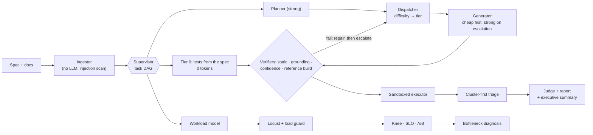
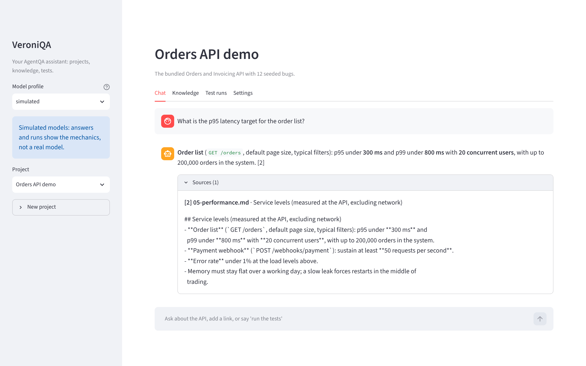

# AgentQA

**An AI tester for APIs that you can trust, audit and afford.** Give it your API's technical
description and the requirements your team already wrote. It plans the tests, writes and runs them,
explains every failure with evidence, and load-tests the service, at a cost you can see and cap.

## Why teams care
Every app you use, from banking to food delivery, runs on APIs, and every release risks breaking
one. The expensive bugs are rarely crashes. They are broken business rules: a wrong total, one
customer seeing another's order, a cancelled order that still ships. Hand-written test suites lag
behind the product, and QA becomes the bottleneck that slows releases or lets bugs escape.

AI can write tests quickly, but most teams will not adopt it as it stands. It invents endpoints that
do not exist, reports bugs it cannot prove, and the bill is unpredictable. AgentQA is built around
those objections:

| What a buyer worries about | What AgentQA does about it |
|---|---|
| "Will it make things up?" | **Guardrails.** Tests may only call what the spec defines, run in a sandbox that blocks unapproved hosts and writes, and pass prompt-injection and secret-redaction checks. |
| "Can we trust its bug reports?" | **Evidence and evals.** Every finding ships with proof and a command to reproduce it. The system is scored against a benchmark API with planted bugs, so you see how many it finds and how often it is wrong, and a CI gate fails the build if quality drops. |
| "What will it cost us?" | **Cost-aware routing.** A dispatcher sends easy work to plain code or a cheap model and escalates to a strong model only when the cheap attempt fails verification. Every decision is in a ledger, and budgets and a kill switch cap spend. |
| "Can we see what it is doing?" | **Observability.** Every agent step, model call, token count and cost is traced (OpenTelemetry), with Phoenix, Prometheus and Grafana wired up to receive it. |
| "Will it survive real workloads?" | **Orchestration.** A supervisor runs specialised agents (planner, generator, triage, reporter) as a task graph with checkpoints, failure isolation and resumable runs. |
| "Is it only functional testing?" | **Performance too.** Load tests compare a clean build with a changed one, so only a change beyond measured noise counts as a regression, and the likely cause is named. |
| "Does it fit how our developers work?" | **Plug-in access.** Chat with **VeroniQA** in the browser, let coding agents such as Claude Code or Cursor call it over MCP, and gate every pull request on an eval and a performance smoke test in CI. |

## What you can show in five minutes
`make demo` runs the whole story against the bundled Orders API, which has 12 functional bugs and
6 performance defects planted in it: plan, tests, run, triaged findings with evidence, a performance
diagnosis and an executive summary, with traces and cost for every step. See
[docs/DEMO.md](docs/DEMO.md) for a talk track. `make veroniqa` opens the same features as a chat:
upload requirements, ask questions with cited answers, and say "run the tests".

**Try VeroniQA online** at <https://veroniqa.vercel.app>, with the introduction video at
<https://veroniqa.vercel.app/watch>. The public demo gives each visitor a private, temporary
workspace preloaded with the Orders API demo. It uses simulated models and only runs tests against
the bundled API. How it is built and deployed: [docs/DEPLOY.md](docs/DEPLOY.md).

Videos, generated by code from the measured results and real screenshots (simulated-model numbers
are labelled on screen):

| video | shows |
|---|---|
| [**Meet VeroniQA** (85 s, with sound)](media/videos/veroniqa-intro.mp4) | a narrated 1080p introduction: knowledge base, cited answers, safe links, test runs from chat, and the cost result; captions burned in plus a [subtitle file](media/videos/veroniqa-intro.srt) |
| [Same bugs found, a fraction of the bill](media/videos/01-cost-vs-quality.mp4) | the dispatcher against "strongest model for everything": recall and cost per run |
| [Trust is a number](media/videos/02-trust-measured.mp4) | performance defects caught, prompt injections quarantined, the saving from memory |
| [Meet VeroniQA](media/videos/03-meet-veroniqa.mp4) | real screenshots: knowledge base, cited answers, a blocked unsafe link, a test run from chat |

## Where it stands
This is a proof of concept. It shows that the approach works end to end on a controlled benchmark,
not that it is ready to drop into a client's environment. Getting it production-ready and fitting it
to each client comes next: their API styles and auth, requirements and data rules, choice of models
and hosting, CI and reporting, and a measured baseline on their own system. In the bundled benchmark
the cost-aware strategy found 94% of the planted bugs, against 92% for always using the strongest
model, at 47% of the cost, and caught 6 of 6 performance defects. **Those numbers come from
simulated models** (the build environment had no API keys), so they show that the mechanics work,
not how a particular real model performs. Real-model tables come from `make eval-live`.
Details and caveats are under [Results](#results) and in
[docs/LIMITATIONS.md](docs/LIMITATIONS.md).

## In technical terms

**Give it an OpenAPI spec and the requirement docs your product team already wrote. Get back a
risk-ranked test plan, executable API tests, a run, triaged findings with evidence, a performance
diagnosis and an executive summary.** The whole system is observable, guarded and measured, and an
MCP server exposes it to coding agents.

## How it works



- **Deterministic first.** Anything derivable from the spec (missing auth, response contracts with no
  undocumented fields, required fields and types, enum and min/max violations, malformed ids,
  pagination contiguity) is generated by code at zero tokens. Models only handle rules that need
  the requirement documents.
- **Cheapest worker that will get it right.** A transparent difficulty score picks the starting tier.
  Each generated test passes static checks, the **grounding guard** (every path, method, field and
  status it uses must exist in the spec) and, when a known-good build exists, must pass on it. If a
  check fails, the test is repaired once, then escalated to the strong model with the failure
  attached. Every decision is logged in the delegation ledger.
- **Findings carry evidence.** Failures are clustered by root cause, and there is one triage call per
  cluster. A claim that cites no evidence is downgraded to `needs_review`; ambiguous findings go to a
  judge from a different model family. Every finding ships with a `curl` repro.
- **Performance, the same way.** A small model writes a validated `WorkloadSpec`; deterministic code
  renders and runs it with Locust; the target's own counters (DB queries per request, DB time, bytes,
  CPU, RSS) and an A/B against a clean build with a *measured* noise band give a compact evidence
  bundle; the model names the bottleneck and the fix.

Details: [architecture](docs/architecture.md) · [plan](docs/PLAN.md) · [ADRs](docs/adr/).

## Run it

```bash
uv sync                                   # Python 3.12, uv
make demo                                 # functional run + perf A/B against the bundled Orders API
uv run agentqa serve                      # http://127.0.0.1:8088 — runs, findings, timeline, ledger
```

A second, differently shaped target ships in `examples/tasks_api/`: a task tracker whose contract is a
**Swagger 2.0** file and whose auth is an **`X-API-Key`** header. Start it with some bugs on and point
AgentQA at it:

```bash
BUGS=T02,T04 make example-tasks           # terminal 1: http://127.0.0.1:8001
uv run agentqa run --target-config examples/tasks_api/agentqa_target.yaml --base-url http://127.0.0.1:8001
```

With the simulated models this finds the two spec-visible bugs (an unvalidated enum filter and a
pagination off-by-one) from zero-token Tier 0 tests and nothing on a clean build; the two
business-rule bugs (T01 reading another user's task, T03 completing a task twice) need real
models. To test your own API, give `--spec` a Swagger 2.0 or OpenAPI 3 file or URL, `--docs` your
requirements, and a target config like the one above (bearer or API-key auth, `sandbox: false`
keeps the run read-only).

Real models: copy `.env.example` to `.env`, add keys, and set `AGENTQA_PROFILE=free|mixed|premium`.
With Docker, `make up` starts Phoenix (:6006), Grafana (:3000), Prometheus and the Collector, and
`make demo` exports traces and metrics to them.

| command | what it does |
|---|---|
| `agentqa run --local-target all --local-reference` | full pipeline against the demo API with every seeded bug, clean build as reference |
| `agentqa run --base-url https://staging... --spec ... --docs ...` | your API (only sandbox targets may be mutated or load-tested) |
| `agentqa report <run-id> [--format summary]` · `agentqa runs` · `agentqa replay <run-id>` | read, list, deterministically replay |
| `agentqa perf run --type stress --perf-bugs P02` · `agentqa perf ab --candidate P01` | load test; relative A/B with diagnosis |
| `agentqa eval --strategies --ablate --seeds 3` · `agentqa eval --perf` · `agentqa eval --gate` | evals and the CI gate |
| `agentqa killswitch` | stop every run at its next check |
| `agentqa veroniqa` | VeroniQA, the chat interface (Streamlit on 127.0.0.1:8501) |
| `agentqa-mcp` | MCP server (stdio or `--http`); setup for Claude Code and Cursor in [docs/MCP.md](docs/MCP.md) |

## VeroniQA
VeroniQA is a chat interface over AgentQA, for people who would rather ask than type commands.



- **Projects are folders** (`<AGENTQA_HOME>/projects/<name>/`): settings, the knowledge sources, a
  vector store and the project's test runs.
- **Knowledge base.** Upload Markdown, text, HTML or PDF files, or add a link. Each source is turned
  into text, split into passages, scanned for prompt injection (suspicious passages are quarantined
  and never retrieved) and indexed in the project's own Chroma collection.
- **Retrieval-augmented answers.** Questions are answered from the passages found by hybrid
  (vector + keyword) search. The answer cites passages by number, and any citation that does not
  point at a retrieved passage is dropped and flagged. If the knowledge does not cover the question,
  VeroniQA says so instead of guessing.
- **Repo features from chat.** A cheap routing step maps each message to one action: answer, add a
  link, run the tests (the project's documents become the requirement docs for test generation),
  list runs, or show a report. On the demo project you choose which seeded bugs to switch on.
- **Safe by default.** Links are fetched only over http(s), only from public addresses (checked again
  after every redirect), up to 2 MB of text; uploads are capped at 5 MB with an allowlist of types;
  the app binds to 127.0.0.1. Details in [docs/SECURITY.md](docs/SECURITY.md).

```bash
make veroniqa            # or: uv run agentqa veroniqa  ->  http://127.0.0.1:8501
```

With `AGENTQA_PROFILE=simulated` (the default) routing and answers come from deterministic
stand-ins: answers are extracts from your documents, not a model's prose. Set a real profile and
keys for real answers. Design notes: [ADR 0010](docs/adr/0010-veroniqa.md).

## The system under test
`target_api/` is an "Orders and Invoicing API" (FastAPI + SQLite, admin/staff/customer tokens, a
signed payment webhook) with **12 seeded functional bugs** (`BUGS=B01,...`) and **6 performance
defects** (`PERF_BUGS=P01,...`). The OpenAPI document is identical for every build. The benchmark
verifies itself. Each functional bug has a hand-written check that passes on the clean build, fails
with the bug on, and still passes when the other 11 bugs are on. Each performance defect has a
relative measurement proving it exists (`target_api/tests/`). The requirement docs are written the
way a customer would write them, SLOs included, and they ship with a poisoned doc that tries to
hijack the agents.

## Results

Commands: `agentqa eval --matrix --strategies --ablate --memory --extras --seeds 3` and
`agentqa eval --perf`. The block below is written by `agentqa eval` from the newest files in
`results/`, and a test fails if it drifts from them.

<!-- results:begin (generated by agentqa eval; do not edit) -->
All numbers below come from **simulated models** (declared error rates, ADR 0003).

**Cost vs quality: four strategies, 3 cold runs each (mean, with min–max where it varied)**

| strategy | bug recall | triage accuracy | hallucination (pre-repair) | list-equivalent $ / run | $ per bug found |
|---|---|---|---|---|---|
| S0 strong model for everything | 92% (83–100%) | 0.97 | 4% | 0.473 | 0.0432 |
| S1 cheap model for everything | 47% (42–50%) | 0.18 | 38% | 0.037 | 0.0065 |
| S2 static role routing | 67% (58–75%) | 0.33 | 33% | 0.173 | 0.0218 |
| **S3 smart dispatcher** | **94% (92–100%)** | **0.91** | 18% | **0.221** | **0.0195** |

Hypothesis targets: S3 within 5 points of S0's recall → **+2.8 points (met)**; S3 at most half of S0's cost → **47% (met)**. S3 used 86k tokens per run against S0's 91k, so the saving comes from tiering (cheap models do most of the work, gated by verification and escalation), not from fewer tokens.

In the ablation, switching off **cascade** hurts most: recall 81% and triage accuracy 0.45. Several other single-mechanism deltas sit within seed noise at n=3; [RESULTS.md](RESULTS.md) shows them all.


**Performance A/B, P01–P06 against a clean build (3 iterations each, same host):** 6/6 defects flagged beyond the measured noise band, 6/6 bottleneck classes correct (rule-based check: 6/6), and 0 false alarms on 1 held-out clean-vs-clean repeat. Agent cost for the whole benchmark: 9.1k tokens.

**Memory (same store, seed 0):** with 9 lessons from run 1, run 2 needed 1 escalation instead of 3 and 6% fewer tokens. Run 3, with diff-aware incremental reuse, cost **71% less** than run 1 (39k tokens vs 106k) at the same recall.

**Guardrails:** the poisoned requirements doc was quarantined at ingestion and never retrieved into a prompt; the adversarial set scored 10/10 detected and 0/6 benign texts flagged. That set was written by the project author, so it is not an independent benchmark.

Full tables, per-category recall, the ablation and the perf confusion data: [RESULTS.md](RESULTS.md), generated by `agentqa eval` from `results/*.json`.
<!-- results:end -->

## Guardrails
| guardrail | what it stops | where |
|---|---|---|
| schema | malformed model output (validated; repaired with the error fed back; retries counted) | `llm/router.py` |
| grounding | invented endpoints, methods, fields and status codes, before anything runs | `guards/grounding.py` |
| static checks | imports, file/process/network access outside the client fixture, dunder tricks, secrets | `guards/static_checks.py` |
| sandbox | requests to any host but the target (client *and* socket level), destructive methods on non-sandbox targets; CPU/memory/time limits | `executor/conftest_template.py` |
| budget | runs past their token, USD, wall-clock or step cap: clean abort with a partial report | `guards/budget.py` |
| prompt injection | poisoned docs: heuristic + small-model classifier, quarantine, delimiting, fixed tool permissions | `guards/injection.py` |
| output safety | keys, tokens and PII in logs, spans, reports and generated code | `guards/redaction.py` |
| kill switch | anything, now | `guards/killswitch.py` |
| circuit breaker + fallback | provider outages and rate limits | `llm/resilience.py`, `llm/router.py` |
| load guard | load against non-allowlisted targets; runaway users, duration, request rate or seeded data; error-rate and host-resource aborts | `perf/runner.py`, `perf/locustfile.py` |

The threat model, supply-chain policy (capped and locked dependencies, weekly audit), known advisories
and open gaps are in [docs/SECURITY.md](docs/SECURITY.md).

## Observability
Every LLM and tool call is a span (`run > stage > agent > llm_call/tool_call`). Each span carries
GenAI semantic-convention attributes plus prompt name, version and hash, cache status, retries, cost
(actual and list-equivalent) and fallback source. Guardrail decisions, escalations and delegations
are span events. Spans go to Phoenix through the OTel Collector and are always saved to the run's
`spans.jsonl`, so a finding can be traced back to the prompts, retrieved chunks and cost that
produced it, even without the stack running. Metrics (`agentqa_*`) go to Prometheus; the Grafana
dashboards and alert rules are generated as code in `deploy/grafana/`. Logs are structlog JSON with
`trace_id` and `run_id`, redacted centrally.

*Dashboard screenshots: not produced in the build environment (no Docker). See Limitations.*

## Eval method and its limits
Ground truth comes from **differential testing**, not labels. Each generated suite runs against the
clean build, every single-bug build and the all-bugs build. A bug counts as detected when some test
passes on clean and fails with that bug on. Triage accuracy is a confusion matrix against those
labels. False positives are measured by triaging the suite's failures on the clean build. Every
cost comparison runs cold: fresh store, LLM cache off. CI splits the work in two:

- **Replay gate, every PR, no keys.** Committed LLM-cache fixtures are replayed in `replay_only`
  mode. A cache miss fails the job. The gate also fails if recall or triage accuracy drop against
  `evals/baselines/main.json`, or if the escalation rate regresses. This catches **code** regressions.
- **Live eval, on demand with keys (nightly if the repository variable `NIGHTLY_EVAL` is `true`; it
  costs money).** Real models are re-scored, because a prompt or model change invalidates the cache. This catches **model and prompt** regressions.

A relative perf A/B (this PR's target vs `main`'s, same runner, measured noise band) also runs on
every PR. The full perf benchmark runs with the live eval.

Limits, briefly: the numbers are simulated; the adversarial and judge-calibration sets were written
by the project author; and the clean build serves both as the cascade's reference and as the baseline. All of it is
spelled out in [LIMITATIONS.md](docs/LIMITATIONS.md).

## What comes next
This is a proof of concept; these are the steps from here to something a client could rely on.

1. Run the live matrix and publish real-model tables; refresh the replay fixtures from them.
2. Replace the simulated triage with a calibrated threshold per model; add self-consistency voting on escalated tasks.
3. Contextual routing (difficulty features as bandit context) and per-tenant learned stats.
4. Tamper-evident audit storage, SSO/RBAC, and a review queue for `needs_review` findings ([ENTERPRISE.md](docs/ENTERPRISE.md)).
5. Run perf in containers with real CPU limits and longer soaks; add trace-based (span count) N+1 detection from Phoenix rather than target counters.
6. An independent red-team set for prompt injection and a human-labelled judge calibration set.

## Built with

**Languages and formats**

| | used for |
|---|---|
| **Python 3.12** | everything: the agents, the target API, evals, the VeroniQA app, scripts and the video tooling |
| YAML | configuration (models, providers, pricing, guardrails, dispatch, target configs), CI workflows, compose |
| Markdown | versioned prompt templates (`prompts/`), requirement documents, docs and reports |
| HTML + Jinja2 | the run reports and the web UI templates; the `/watch` page |
| SQL (SQLite) | the run store and cross-run memory |
| JSON / JSONL | OpenAPI specs, results, recorded model responses for the replay gate |
| Dockerfile, Makefile | container images and the developer commands |

**Tools and libraries**

| area | tools |
|---|---|
| Packaging and quality | [uv](https://docs.astral.sh/uv/) (locked installs), **pytest** (unit, end-to-end and app tests), pytest-cov, **ruff** (lint, format, security rules), **mypy**, pre-commit, pip-audit, Dependabot |
| Web and APIs | **FastAPI**, Uvicorn, Starlette, Pydantic, HTTPX, Typer (the `agentqa` CLI) |
| Models | Anthropic, OpenAI and Google Gen AI SDKs (Claude, Gemini, OpenRouter), plus deterministic simulated models for keyless runs |
| Retrieval (RAG) | **Chroma** (embedded vector database), BM25 lexical search, feature-hashing or fastembed embeddings, pypdf |
| Agent integration | **MCP** (Model Context Protocol) server for Claude Code, Cursor and other clients |
| Interfaces | **Streamlit** (VeroniQA), Jinja2 (reports and the web UI) |
| Observability | **OpenTelemetry** (traces and metrics, GenAI and OpenInference attributes), structlog, Arize Phoenix, Prometheus, Grafana, cAdvisor |
| Performance | **Locust**, psutil, matplotlib (charts) |
| Video and audio | Pillow, NumPy, ffmpeg, Kokoro-82M (kokoro-onnx) for the voice, sherpa-onnx Whisper for the voice check, Playwright and Chromium for screenshots |
| CI/CD and hosting | GitHub Actions, GitGuardian, Docker Compose, Vercel (container image for the VeroniQA demo) |

## Repository map

A request flows through the packages roughly in this order: `ingest` → `orchestrator` (with
`dispatch`, `agents`, `guards`, `llm`) → `executor` → `agents/triage` → `agents/reporter`. `perf`,
`evals`, `mcp` and `api` sit on top of that pipeline.

```text
agentqa/                 the Python package (installed as the `agentqa` and `agentqa-mcp` commands)
├── cli.py               Typer CLI: run, report, replay, runs, killswitch, serve, eval, perf run/ab
├── config.py            typed loaders for config/*.yaml (checks the judge's family differs from the generators')
├── models.py            pydantic artifacts passed between stages: Endpoint, SpecBundle, TestIntent,
│                        GeneratedTest, ValidatedTest, RunResult, Evidence, TriageVerdict, Finding
├── store.py             SQLite store: runs, task checkpoints, delegation ledger, routing stats, lessons
├── memory.py            lessons learned from earlier runs, fed back into later ones
├── target_config.py     loads a target description (spec, docs, sandbox flag, role tokens, webhook signing)
├── llm/                 model access
│   ├── router.py        LLMClient.complete: tier/role → model, cache, rate limit, retries, fallback,
│   │                    circuit breaker, schema-repair retries, cost ledger
│   ├── adapters/        Anthropic, Gemini, OpenRouter (OpenAI SDK) and a fake adapter for tests
│   ├── simulated.py     deterministic simulated models with declared error rates (ADR 0003)
│   ├── cache.py         disk cache (off / read_write / replay_only) used for deterministic replay
│   ├── normalize.py     strips run-specific noise (paths, ids) from prompts so replay hits the cache
│   ├── prompts.py       loads the versioned prompts in prompts/
│   ├── pricing.py       cost ledger: actual and list-equivalent USD
│   └── ratelimit.py, resilience.py, types.py
├── ingest/              no-LLM ingestion: OpenAPI 3 parsing (Swagger 2.0 converted on load), chunking, injection scan, local embeddings,
│                        BM25, Chroma vector store and hybrid retrieval (ADR 0004)
├── agents/
│   ├── synthesizer.py   Tier 0: tests derived from the spec by code, zero tokens
│   ├── planner.py       risk-ranked test plan from the spec plus retrieved requirement chunks
│   ├── risk.py          risk scoring used to rank intents
│   ├── generator.py     writes pytest tests for intents (single and batched)
│   ├── triage.py        clusters failures, one triage call per cluster, evidence bundle, curl repro
│   └── reporter.py      technical report (Markdown/HTML), executive summary, judge scoring
├── guards/              grounding (every path/field/status must exist in the spec), static checks
│                        (ruff, import allowlist, banned calls), prompt injection (heuristics + classifier),
│                        token/cost budget, kill switch, secret/PII redaction
├── executor/            runs generated tests in a sandbox: per-test files, host allowlist, method
│                        guard, resource limits, redacted request/response log, flaky reruns
├── orchestrator/        graph.py: task DAG supervisor with checkpoints and failure isolation;
│                        pipeline.py builds and runs one run's graph; stages.py (ingest, Tier 0,
│                        plan, dispatch, generate), reporting.py, state.py, run_config.py
├── dispatch/            cost intelligence: difficulty features, tier policy (static, cascade, Thompson
│                        sampling), verification-gated cascade, delegation ledger, strategies S0–S3
├── perf/                workload model → Locust run → knee/SLO/noise band/A-B analysis → bottleneck
│                        triage and charts
├── evals/               ground truth by differential runs (ADR 0007), scoring harness, the experiments
│                        behind RESULTS.md, the CI gate and the RESULTS.md renderer
├── obs/                 OpenTelemetry tracing (GenAI + OpenInference attributes), metrics, structlog
├── mcp/server.py        MCP server: ingest_spec, plan_tests, run_suite, triage_run, get_report,
│                        list_runs, perf_ab, plus report resources
├── api/                 FastAPI web UI (runs, findings, timeline, delegation ledger, scoreboard)
├── veroniqa/            the VeroniQA agent: projects.py, knowledge.py (uploads, chunking, injection
│                        scan, per-project vector store), fetch.py (SSRF-safe links), rag.py (cited
│                        answers), agent.py (routing to actions), runs.py, app.py (Streamlit UI),
│                        hosted.py and server.py (public demo: workspaces, /watch, intro video)
└── sim/                 the rule libraries behind the simulated models

prompts/                 versioned prompt templates (front matter + system/user sections), one per role
config/                  providers, model profiles (free/mixed/premium/simulated), pricing with
                         "as of" dates, guardrails, dispatch thresholds, perf defaults
examples/tasks_api/      a second sample target: Swagger 2.0 contract, X-API-Key auth, bugs T01-T04, its own
                         requirements doc and target config (`make example-tasks`)
target_api/              the system under test
├── app/                 FastAPI + SQLite Orders and Invoicing API: main.py (app, middleware),
│                        routes_*.py, schemas.py, deps.py (auth), state.py, db.py; bugs.py switches
│                        seeded bugs on
├── bugs.yaml            the 12 functional bugs (B01–B12) with category, endpoint and expected behaviour
├── perf_bugs.yaml       the 6 performance defects (P01–P06) with bottleneck class and signature
├── docs/                requirement documents (01–05) and poisoned.md, the injection test
├── openapi.json         the spec, identical for every build (regenerate with export_openapi.py)
├── launcher.py          starts a build in-process with chosen bugs (used by evals and the demo)
├── agentqa_target.yaml  target description used by the CLI
└── tests/               self-checks proving every seeded bug and perf defect exists and is isolated
deploy/                  docker-compose stack: target API, OTel Collector, Phoenix, Prometheus, cAdvisor,
                         Grafana (provisioned dashboards), Dockerfile for the target
evals/
├── datasets/            adversarial injection set and judge calibration set (self-authored)
├── baselines/main.json  thresholds the CI gate compares against
└── fixtures/llm_cache/  recorded model responses that make the CI replay gate deterministic
results/                 raw eval output (JSON, named date-commit-kind) and charts; RESULTS.md is
                         generated from these files
docs/                    PLAN.md (milestones and status), architecture.md, ADRs 0001–0010, SECURITY.md,
                         LIMITATIONS.md, ENTERPRISE.md, DEMO.md (5-minute script), MCP.md (client setup),
                         DEPLOY.md (the public VeroniQA demo)
scripts/                 demo.py (`make demo`), secret_scan.py (pre-commit and CI), videos/ (video
                         engine, storyboards, screenshot capture, the narrated intro with its music
                         generator and voice check; `make videos`, `make video-intro`)
Dockerfile.vercel        the public VeroniQA demo as a container image (see docs/DEPLOY.md)
media/                   videos/ (rendered videos, the intro's poster frame and subtitles) and
                         veroniqa/ (app screenshots, the run they show and element positions for
                         highlights, captured by scripts/videos/capture_veroniqa.py)
tests/                   unit and end-to-end tests for every package (fixtures/petstore.yaml is a
                         second spec used to show nothing is hard-wired to the demo API)
.github/workflows/       ci.yml: lint, types, tests, secret scan, replay gate, perf A/B smoke;
                         eval-live.yml: real-model eval (manual, or nightly if enabled); audit.yml: weekly
                         dependency audit; dependabot.yml: update PRs
```

Root files: `pyproject.toml` (dependencies, ruff, mypy, pytest settings), `uv.lock`, `Makefile`,
`.env.example` (every variable, no values), `.pre-commit-config.yaml` (ruff and secret scan),
`.streamlit/config.toml` (VeroniQA: loopback only, 5 MB uploads, no telemetry), `RESULTS.md`
(generated).

Make targets:

| target | what it does |
|---|---|
| `make install` | `uv sync` |
| `make lint` · `make fmt` · `make typecheck` | ruff + mypy · auto-fix and format · mypy only |
| `make test` · `make test-fast` · `make cov` | full suite · skip tests marked slow · with coverage |
| `make secrets` | secret scan over tracked files |
| `make audit` | known-vulnerability scan of the locked dependencies |
| `make example-tasks` | run the Tasks API example on :8001 (`BUGS=T01,T04 make example-tasks`) |
| `make veroniqa` | open VeroniQA on http://127.0.0.1:8501 |
| `make veroniqa-hosted` | the public-demo build locally on http://127.0.0.1:8502 (see [docs/DEPLOY.md](docs/DEPLOY.md)) |
| `make videos` | render the three short promo videos from the result files |
| `make video-intro` | render the narrated VeroniQA introduction and check its soundtrack |
| `make target` | run the demo API on :8000 (`BUGS=B01 PERF_BUGS=P01 make target`) |
| `make up` · `make down` | start or stop the Docker observability stack |
| `make demo` | the 5-minute demo (functional run plus perf A/B) |
| `make eval` · `make eval-replay` · `make eval-live` | simulated matrix · CI gate from recorded responses · real models |
| `make perf-ab` | short perf A/B smoke test |
| `make clean` | remove local run data and caches |
