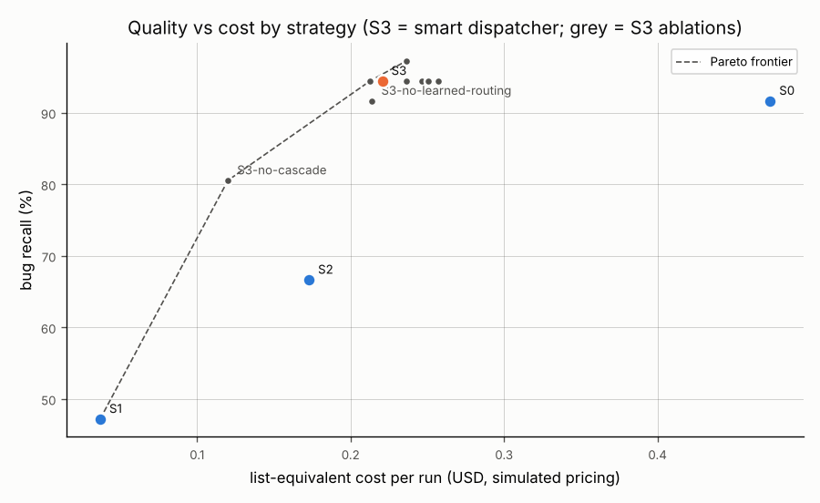
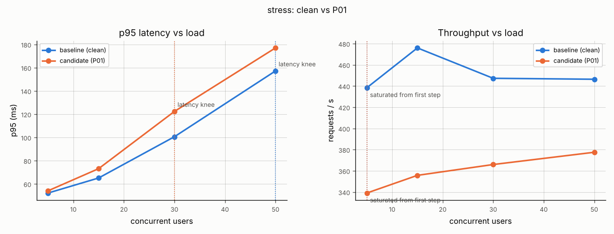
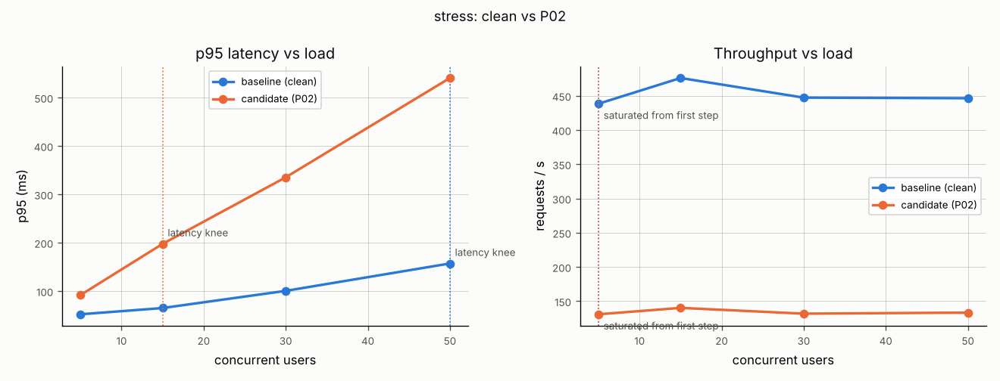
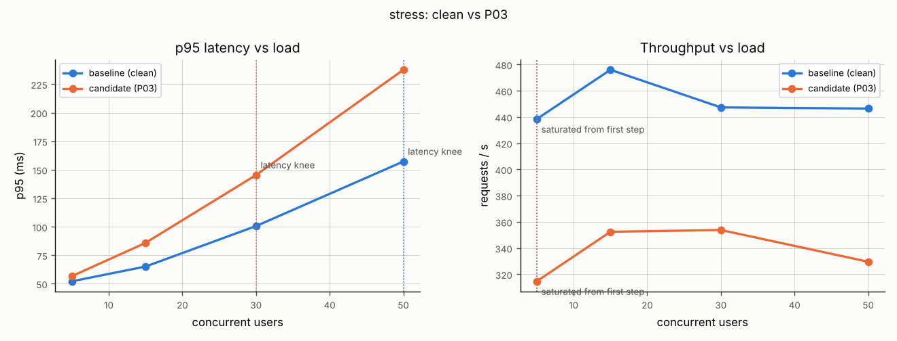
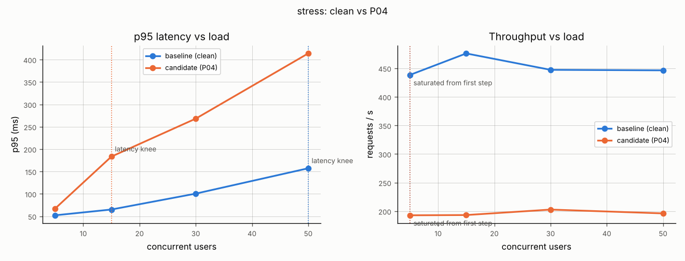
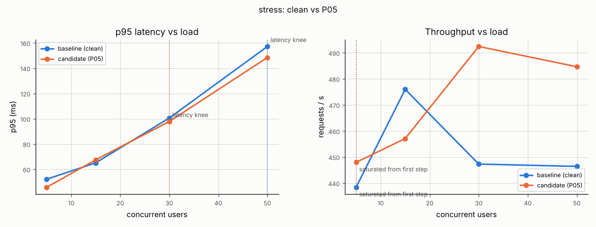
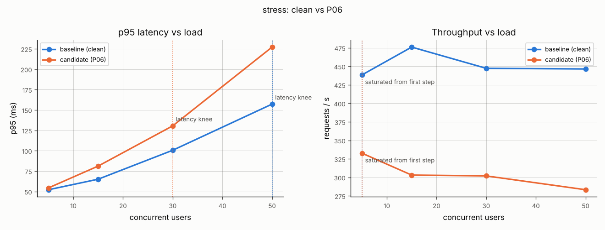

# Results

Generated by `agentqa eval` from the JSON files in `results/`; do not edit by hand.

Functional results: `2026-10-07-8504fa4-functional.json` (commit `8504fa4`, 2026-10-07T18:24:09+00:00).

> **SIMULATED MODELS.** These numbers come from the deterministic simulated models
> (ADR 0003). They measure the pipeline's mechanics: whether Tier 0, the cascade, the
> guards and the triage work as designed, and what each cost mechanism saves. They are
> **not** a measurement of any real LLM. Real-model tables come from `make eval-live`.

## Profile matrix (strategy S3, mean with min–max over seeds)

| profile | n | recall | precision | triage acc. | hallucination | validity | cost/run (list $) | cost per bug | p95 LLM latency (s) |
|---|---|---|---|---|---|---|---|---|---|
| simulated | 3 | 94% (92%–100%) | 1.00 | 0.81 (0.53–0.94) | 18% (13%–20%) | 100% | 0.214 (0.207–0.226) | 0.0189 (0.0188–0.0189) | 0.002 (0.001–0.003) |

## Strategy comparison and ablation (cold cache, fresh store per run)

| strategy | n | recall | precision | triage acc. | halluc. | tokens | list $ | $ per bug | escalation rate | uncovered | FP on clean |
|---|---|---|---|---|---|---|---|---|---|---|---|
| S0 | 3 | 92% (83%–100%) | 1.00 | 0.97 (0.91–1.00) | 4% (0%–6%) | 91099 (88041–94158) | 0.473 (0.458–0.488) | 0.0432 (0.0407–0.0458) | 0.00 | 0.0 | 0.0 |
| S1 | 3 | 47% (42%–50%) | n/a | 0.18 (0.00–0.33) | 38% (21%–50%) | 74526 (68978–79877) | 0.037 (0.035–0.040) | 0.0065 (0.0059–0.0070) | 0.00 | 2.0 (1.0–3.0) | 0.0 |
| S2 | 3 | 67% (58%–75%) | 1.00 | 0.33 (0.29–0.38) | 33% (25%–42%) | 100605 (93510–110945) | 0.173 (0.168–0.179) | 0.0218 (0.0198–0.0246) | 0.00 | 3.3 (3.0–4.0) | 0.0 |
| S3 | 3 | 94% (92%–100%) | 1.00 | 0.91 (0.83–1.00) | 18% (13%–20%) | 86430 (76471–94215) | 0.221 (0.189–0.239) | 0.0195 (0.0172–0.0213) | 0.04 (0.02–0.06) | 0.0 | 0.0 |
| S3-no-deterministic-first | 3 | 97% (92%–100%) | 1.00 | 0.72 (0.42–0.92) | 17% (5%–22%) | 86875 (80773–92241) | 0.236 (0.230–0.240) | 0.0203 (0.0192–0.0218) | 0.09 (0.05–0.11) | 0.0 | 0.0 |
| S3-no-cascade | 3 | 81% (67%–92%) | 1.00 | 0.45 (0.24–0.73) | 31% (27%–33%) | 72288 (69947–76226) | 0.120 (0.118–0.122) | 0.0127 (0.0111–0.0151) | 0.00 | 2.7 (2.0–4.0) | 0.0 |
| S3-no-batching | 3 | 94% (92%–100%) | 1.00 | 0.96 (0.94–1.00) | 22% (13%–33%) | 98029 (85938–106118) | 0.224 (0.186–0.261) | 0.0197 (0.0169–0.0217) | 0.04 (0.02–0.06) | 0.0 | 0.0 |
| S3-no-dedupe | 3 | 94% (92%–100%) | 1.00 | 0.91 (0.89–0.95) | 18% (13%–20%) | 86187 (75500–97776) | 0.223 (0.195–0.252) | 0.0196 (0.0178–0.0210) | 0.04 (0.02–0.06) | 0.0 | 0.0 |
| S3-no-incremental | 3 | 94% (92%–100%) | 1.00 | 0.84 (0.58–1.00) | 18% (13%–20%) | 84819 (76400–94554) | 0.213 (0.197–0.239) | 0.0187 (0.0179–0.0199) | 0.04 (0.02–0.06) | 0.0 | 0.0 |
| S3-no-cluster-first-triage | 3 | 94% (92%–100%) | 1.00 | 0.87 (0.78–0.94) | 18% (13%–20%) | 102255 (97902–106549) | 0.246 (0.235–0.259) | 0.0218 (0.0204–0.0235) | 0.03 (0.02–0.06) | 0.0 | 0.0 |
| S3-no-caching | 3 | 94% (92%–100%) | 1.00 | 1.00 | 18% (13%–20%) | 86850 (79919–96481) | 0.251 (0.234–0.275) | 0.0221 (0.0212–0.0229) | 0.03 (0.02–0.04) | 0.0 | 0.0 |
| S3-no-context-budgeting | 3 | 94% (83%–100%) | 1.00 | 0.84 (0.79–0.88) | 23% (20%–29%) | 95888 (95276–97031) | 0.257 (0.247–0.266) | 0.0229 (0.0206–0.0266) | 0.05 (0.04–0.06) | 0.0 | 0.0 |
| S3-no-learned-routing | 3 | 92% | 1.00 | 0.87 (0.78–0.94) | 31% (27%–33%) | 86466 (80526–90643) | 0.214 (0.179–0.246) | 0.0195 (0.0162–0.0224) | 0.04 (0.02–0.06) | 0.0 | 0.0 |
| S3-no-budget-allocation | 3 | 94% (92%–100%) | 1.00 | 0.80 (0.50–1.00) | 18% (13%–20%) | 90000 (75081–105607) | 0.237 (0.194–0.275) | 0.0208 (0.0176–0.0230) | 0.05 (0.02–0.06) | 0.0 | 0.0 |

**Hypothesis check** (targets, not claims): S3 within 5 points of S0 recall → measured +2.8 points (met); S3 at most half of S0's list-equivalent cost → measured 47% of S0 (met).

Savings attributed to each mechanism (S3 with that mechanism off, relative to S3):

| mechanism off | Δ tokens | Δ list $ | Δ recall (points) |
|---|---|---|---|
| deterministic-first | +445 | +0.0155 | +2.8 |
| cascade | -14143 | -0.1005 | -13.9 |
| batching | +11599 | +0.0035 | +0.0 |
| dedupe | -244 | +0.0023 | +0.0 |
| incremental | -1611 | -0.0079 | +0.0 |
| cluster-first-triage | +15825 | +0.0257 | +0.0 |
| caching | +420 | +0.0300 | +0.0 |
| context-budgeting | +9457 | +0.0364 | -0.0 |
| learned-routing | +36 | -0.0066 | -2.8 |
| budget-allocation | +3569 | +0.0159 | +0.0 |

Per-category recall (mean over seeds):

| strategy | auth/permission | boundary | contract-conformance | data-leak | error-handling | idempotency | money/precision | state-transition | time/timezone | validation | webhooks/signatures |
|---|---|---|---|---|---|---|---|---|---|---|---|
| S0 | 0.83 | 1.00 | 0.67 | 1.00 | 1.00 | 1.00 | 1.00 | 1.00 | 1.00 | 0.67 | 1.00 |
| S1 | 0.83 | 0.33 | 0.67 | 0.67 | 0.67 | 0.67 | 0.00 | 0.00 | 0.00 | 0.67 | 0.33 |
| S2 | 0.83 | 1.00 | 0.67 | 1.00 | 1.00 | 1.00 | 0.33 | 0.33 | 0.00 | 0.67 | 0.33 |
| S3 | 1.00 | 1.00 | 1.00 | 1.00 | 1.00 | 1.00 | 1.00 | 0.67 | 0.67 | 1.00 | 1.00 |
| S3-no-deterministic-first | 1.00 | 1.00 | 0.67 | 1.00 | 1.00 | 1.00 | 1.00 | 1.00 | 1.00 | 1.00 | 1.00 |
| S3-no-cascade | 1.00 | 1.00 | 1.00 | 1.00 | 1.00 | 1.00 | 0.33 | 0.33 | 0.33 | 1.00 | 0.67 |
| S3-no-batching | 1.00 | 1.00 | 1.00 | 1.00 | 1.00 | 1.00 | 1.00 | 0.67 | 0.67 | 1.00 | 1.00 |
| S3-no-dedupe | 1.00 | 1.00 | 1.00 | 1.00 | 1.00 | 1.00 | 1.00 | 0.67 | 0.67 | 1.00 | 1.00 |
| S3-no-incremental | 1.00 | 1.00 | 1.00 | 1.00 | 1.00 | 1.00 | 1.00 | 0.67 | 0.67 | 1.00 | 1.00 |
| S3-no-cluster-first-triage | 1.00 | 1.00 | 1.00 | 1.00 | 1.00 | 1.00 | 1.00 | 0.67 | 0.67 | 1.00 | 1.00 |
| S3-no-caching | 1.00 | 1.00 | 1.00 | 1.00 | 1.00 | 1.00 | 1.00 | 0.67 | 0.67 | 1.00 | 1.00 |
| S3-no-context-budgeting | 1.00 | 1.00 | 1.00 | 1.00 | 1.00 | 1.00 | 0.67 | 0.67 | 1.00 | 1.00 | 1.00 |
| S3-no-learned-routing | 1.00 | 1.00 | 1.00 | 1.00 | 1.00 | 1.00 | 1.00 | 0.67 | 0.33 | 1.00 | 1.00 |
| S3-no-budget-allocation | 1.00 | 1.00 | 1.00 | 1.00 | 1.00 | 1.00 | 1.00 | 0.67 | 0.67 | 1.00 | 1.00 |

## Memory and incremental runs (same store, seed 0)

Lessons stored after run 1: 9.

| run | recall | hallucination | tokens | list $ | escalations |
|---|---|---|---|---|---|
| run1_cold | 92% | 20% | 105542 | 0.2477 | 3 |
| run2_with_lessons | 92% | 20% | 98737 | 0.2143 | 1 |
| run3_incremental | 92% | 0% | 38899 | 0.0709 | 0 |

## Prompt injection

- Poisoned requirements doc quarantined: **True**; ever retrieved into a prompt: **False**
- Adversarial set detection rate: **100%**; benign false-positive rate: 0% (1 decided by the classifier). Caveat: adversarial set written by the same author as the heuristics; not an independent benchmark.

## Judge calibration

Agreement with self-labelled set (within 1 point on accuracy and actionability): **100%** of 10. labels are the author's own judgement (self-labelled set); with the simulated judge, whose rules were written by the same author, agreement is near-circular and only shows the harness works. Real calibration needs a live judge model.

## Performance A/B benchmark (`2026-10-07-8504fa4-perf.json`, commit `8504fa4`)

Host: {'cpus': 4, 'platform': 'Linux-6.18.44-fc-v77-x86_64-with-glibc2.39', 'python': '3.12.3', 'target_cpu_pinning': '1 core', 'note': 'shared build host; compare relatively (A/B), not absolutely'}. Iterations per build: 3. Relative numbers only.

- Perf-defect recall: **100%**; bottleneck-classification accuracy (model): **100%**; rule-based diagnosis accuracy: 100%
- False-alarm rate on clean-vs-clean repeats: **0%**; noise band (from 1 clean pair(s), held-out repeat for the false-alarm test): p95 ±0.35 log-ratio, throughput ±0.46, memory growth ±50 MB; held-out detail: {'server_signals': [], 'flagged': [], 'rss_growth_delta_mb': -6.4}
- Agent cost for the whole benchmark: 9125 tokens ($0.0117 list-equivalent)

| defect | expected | regressed | diagnosis | rule check | escalation path |
|---|---|---|---|---|---|
| P01 | n_plus_one | True | n_plus_one | n_plus_one | T1:low_confidence → T2:ok |
| P02 | missing_index | True | missing_index | missing_index | T1:ok |
| P03 | unbounded_payload | True | unbounded_payload | unbounded_payload | T1:low_confidence → T2:ok |
| P04 | blocking_handler | True | blocking_handler | blocking_handler | T1:ok |
| P05 | pool_exhaustion | True | pool_exhaustion | pool_exhaustion | T1:ok |
| P06 | memory_leak | True | memory_leak | memory_leak | T1:ok |

