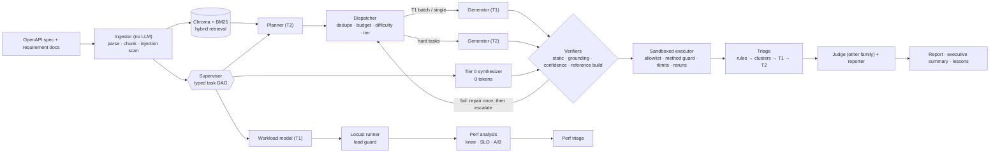

# Architecture

| layer | module | what to read first |
|---|---|---|
| provider layer | `agentqa/llm/` | `router.py` (cache, rate limit, retries, fallback, schema repair, cost, span) |
| agents | `agentqa/agents/` | `planner.py`, `generator.py`, `synthesizer.py`, `triage.py`, `reporter.py` |
| guards | `agentqa/guards/` | `grounding.py`, `static_checks.py`, `injection.py`, `budget.py`, `killswitch.py`, `redaction.py` |
| orchestration | `agentqa/orchestrator/` | `graph.py` (DAG engine), `pipeline.py` (the run) |
| delegation | `agentqa/dispatch/` | `policy.py`, `cascade.py`, `savings.py`, `learned.py`, `strategies.py` |
| performance | `agentqa/perf/` | `locustfile.py`, `runner.py`, `analysis.py`, `pipeline.py` |
| evals | `agentqa/evals/` | `groundtruth.py`, `harness.py`, `run.py` |
| observability | `agentqa/obs/`, `deploy/` | `tracing.py`, `metrics.py`, `grafana/build_dashboards.py` |
| surfaces | `agentqa/cli.py`, `agentqa/mcp/server.py`, `agentqa/api/app.py` | |
| simulated models | `agentqa/llm/simulated.py`, `agentqa/sim/` | ADR 0003 |

Agents never call each other. The supervisor passes typed artifacts (`agentqa/models.py`) between
them, checkpoints each task result to SQLite, isolates failures, and checks the kill switch and the
budget before every task.
